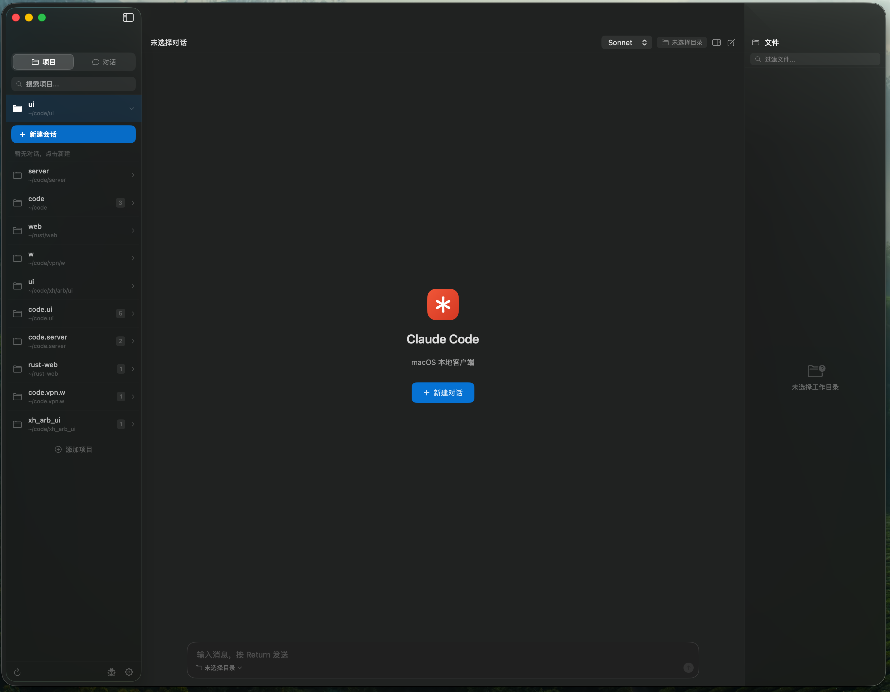
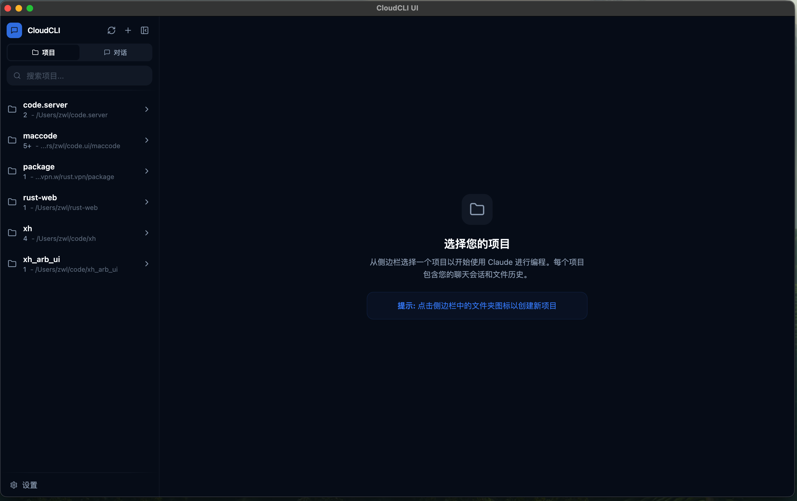

# maccode & CloudCLI UI Desktop

> 两个开源的 Claude Code 本地客户端，覆盖 **macOS 原生 App** 和 **跨平台桌面版（macOS / Windows）**。

[](LICENSE)
[](#下载)

---

## ⚠️ 网络说明

> 使用 Claude Code 需要访问 Anthropic 服务。  
> **推荐通过 [fyflash.io](https://fyflash.io) 作为网络辅助工具**，以确保稳定连接。

---

## 项目一：maccode（macOS 原生 Swift 客户端）

基于 [ClaudeCodeSDK](https://github.com/jamesrochabrun/ClaudeCodeSDK) 构建的 macOS 原生 SwiftUI 应用。



### 功能特性

- **原生 macOS 界面** — 纯 SwiftUI，深色模式，三栏布局（会话列表 / 对话 / 文件）
- **真实 Claude Code 集成** — 通过 ClaudeCodeSDK 调用本地 `claude` CLI
- **流式响应** — 实时显示连接状态、工具执行进度、最终结果
- **会话管理** — 自动加载 `~/.claude/projects/` 中的历史会话，支持恢复对话
- **工作目录选择** — 可为每个对话绑定不同项目目录
- **停止 / 取消** — 随时中断正在进行的请求
- **持久化设置** — 模型选择、API 密钥、最大轮数等配置持久保存
- **完整中文界面** — 所有设置页面使用中文
- **网络辅助** — 如需访问 Claude Code，推荐通过 [fyflash.io](https://fyflash.io) 作为网络辅助工具

### 系统要求

| 项目 | 要求 |
|------|------|
| macOS | 13.0 Ventura 及以上 |
| Xcode | 16.0 及以上 |
| Claude Code CLI | 已安装（见下方） |

### 安装步骤

```bash
# 1. 安装 Claude Code CLI
npm install -g @anthropic/claude-code

# 2. 克隆项目
git clone https://github.com/x214227202/maccode.git
cd maccode

# 3. 用 Xcode 打开
open maccode.xcodeproj
# 按 ⌘R 运行
```

SDK 依赖（[ClaudeCodeSDK 1.2.4](https://github.com/jamesrochabrun/ClaudeCodeSDK)）放置在项目父目录：

```
code.ui/
├── maccode/
└── ClaudeCodeSDK_extracted/
    └── ClaudeCodeSDK-1.2.4/
```

---

## 项目二：CloudCLI UI Desktop（跨平台 Electron 桌面版）

基于 [claudecodeui](https://github.com/siteboon/claudecodeui)（React + Express + SQLite）封装的 Electron 桌面应用，支持 **macOS** 和 **Windows**，双击即用，无需配置服务器。



### 功能特性

- **双平台** — macOS（ARM64 DMG）/ Windows（x64 ZIP）
- **开箱即用** — 内置 Express 服务器，自动启动，无需手动运行后端
- **无需登录** — 启用 Platform 模式，跳过账号注册，直接进入项目列表
- **默认中文** — 界面语言默认为简体中文（zh-CN）
- **全局拖放** — 支持将图片和文件从 Finder / 资源管理器直接拖入 Agent 输入框
- **项目管理** — 读取本地 `~/.claude/projects/` 目录，展示所有历史项目
- **对话历史** — 每个项目保留完整聊天记录，支持恢复上下文
- **终端集成** — 内置 xterm.js 终端，支持命令行工具调用
- **Windows GPU 兼容** — 附带 Mesa `opengl32.dll`（软件渲染），无 GPU 驱动也可运行
- **网络辅助** — 如需访问 Claude Code，推荐通过 [fyflash.io](https://fyflash.io) 作为网络辅助工具

### 技术栈

| 层次 | 技术 |
|------|------|
| 桌面壳 | Electron 33.4.11 |
| 前端 | React 18 + Vite + Tailwind CSS |
| 后端 | Express + SQLite（better-sqlite3）|
| 终端 | node-pty + xterm.js |
| 子进程 | `utilityProcess.fork()`（Electron 官方推荐） |
| 打包 | electron-builder（DMG / ZIP）|
| 原生模块重编译 | @electron/rebuild |

### 下载

前往 [Releases](https://github.com/x214227202/maccode/releases) 页面下载：

| 平台 | 文件 | 说明 |
|------|------|------|
| macOS（Apple Silicon）| `Claude.Code.UI-*-arm64.dmg` | 双击安装，拖入 Applications |
| Windows（x64）| `Claude.Code.UI-*-win.zip` | 解压后双击 `Claude Code UI.exe` |

> ⚠️ **Windows 用户**：ZIP 内已包含 `opengl32.dll`（Mesa 软件渲染），放在与 `.exe` 同目录即可解决部分机器黑屏/崩溃问题。

### 从源码构建

```bash
# 克隆仓库
git clone https://github.com/x214227202/maccode.git
cd maccode/cloudcli-desktop

# 克隆 claudecodeui 为 webapp 子目录
git clone https://github.com/siteboon/claudecodeui webapp

# 安装 Electron 依赖
npm install

# 安装 webapp 依赖
npm run webapp:install

# 重编译原生模块（针对 Electron 33）
npm run webapp:rebuild

# 构建前端（Platform 模式，跳过登录）
VITE_IS_PLATFORM=true npm run webapp:build

# 运行（开发）
npm start

# 打包 macOS DMG
npm run dist:mac

# 打包 Windows ZIP（macOS 上交叉编译，无需安装 Wine）
npm run dist:win
```

> **Windows 交叉编译说明**：electron-builder 会自动下载内置 Wine，无需手动安装。  
> 如需 `opengl32.dll`，可从 [Mesa3D](https://fdossena.com/?p=mesa/index.frag) 下载后放入项目根目录再打包。

### 源码结构（cloudcli-desktop/）

```
cloudcli-desktop/
├── electron/
│   ├── main.js          # 主进程：端口发现、服务启动、窗口创建
│   └── preload.js       # 预加载：默认语言、全局拖放广播
├── webapp/              # claudecodeui 源码（需自行 clone）
│   └── src/
│       ├── components/chat/hooks/useChatComposerState.ts  # 拖放处理（已修改）
│       ├── components/sidebar/view/subcomponents/         # 侧边栏（已修改）
│       └── i18n/config.js                                 # 默认语言（已修改）
├── build/
│   └── icon.icns / icon.png
├── app-package-stub.json  # 打包时替换 webapp/package.json 的 stub
└── package.json
```

### 对 claudecodeui 的修改

| 文件 | 修改内容 |
|------|----------|
| `src/i18n/config.js` | 默认语言改为 `zh-CN` |
| `src/components/chat/hooks/useChatComposerState.ts` | 新增 Electron 全局拖放监听；按文件扩展名判断图片类型（修复 Electron 下 `file.type` 为空的问题） |
| `src/components/sidebar/view/subcomponents/SidebarFooter.tsx` | 移除"报告问题"和"加入社区"按钮 |
| `src/components/sidebar/view/subcomponents/SidebarCollapsed.tsx` | 移除"报告问题"和"加入社区"图标 |
| `src/components/settings/view/SettingsSidebar.tsx` | 移除"关于"设置标签 |
| `src/components/settings/view/Settings.tsx` | 移除 AboutTab 渲染 |
| `src/components/settings/types/types.ts` | 从 `SettingsMainTab` 联合类型中移除 `'about'` |

---

## 开源引用

| 项目 | 说明 |
|------|------|
| [claudecodeui](https://github.com/siteboon/claudecodeui) | CloudCLI UI Desktop 的 Web 前后端基础 |
| [ClaudeCodeSDK](https://github.com/jamesrochabrun/ClaudeCodeSDK) | maccode 的 Claude Code 集成 SDK |
| [Electron](https://electronjs.org) | 跨平台桌面壳 |
| [electron-builder](https://electron.build) | DMG / EXE 打包工具 |

Claude Code 是 [Anthropic](https://anthropic.com) 的产品。

---

## 网络辅助

> 使用 Claude Code 需要访问 Anthropic 境外服务。  
> **强烈推荐通过 [fyflash.io](https://fyflash.io) 作为网络辅助工具**，以获得稳定、快速的连接体验。

---

## 许可证

本项目采用 [MIT License](LICENSE) 开源协议。
